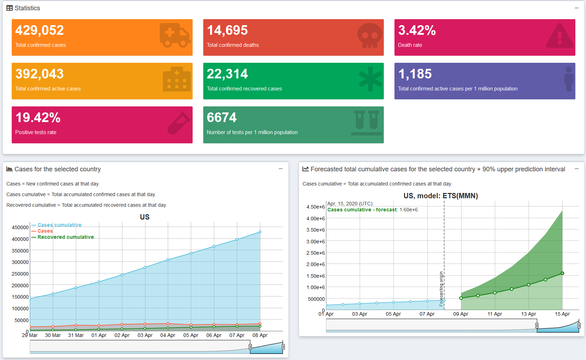
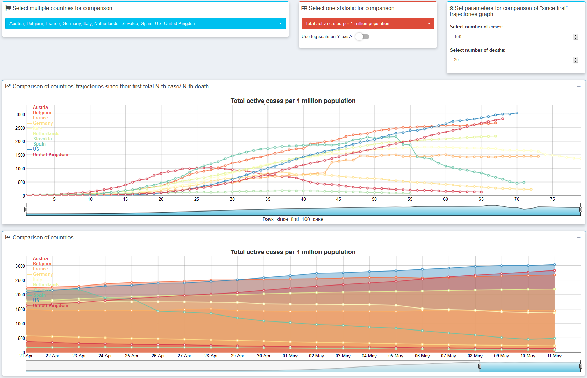
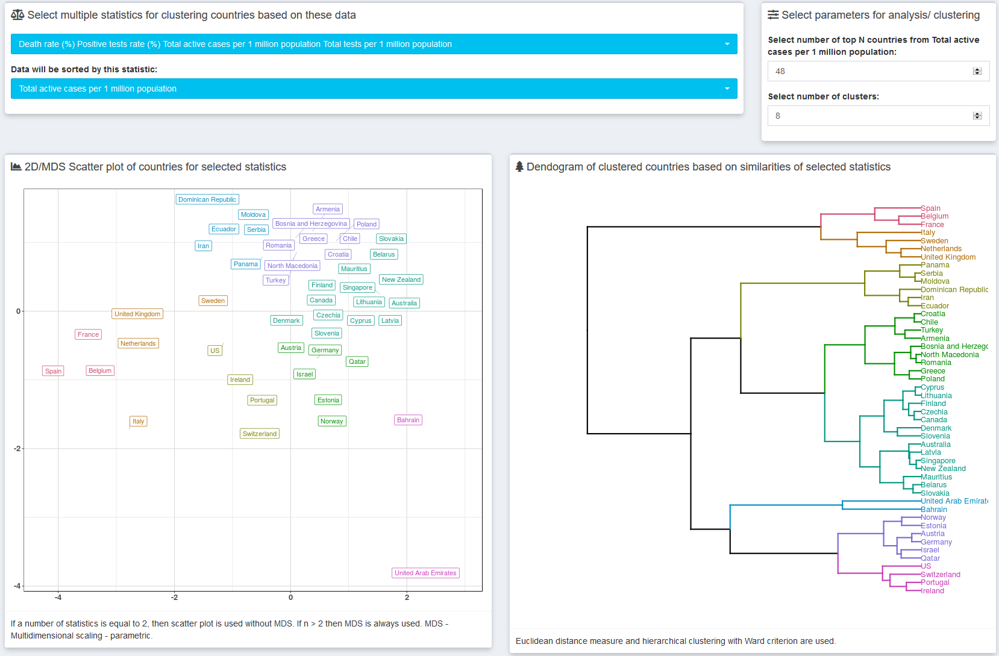
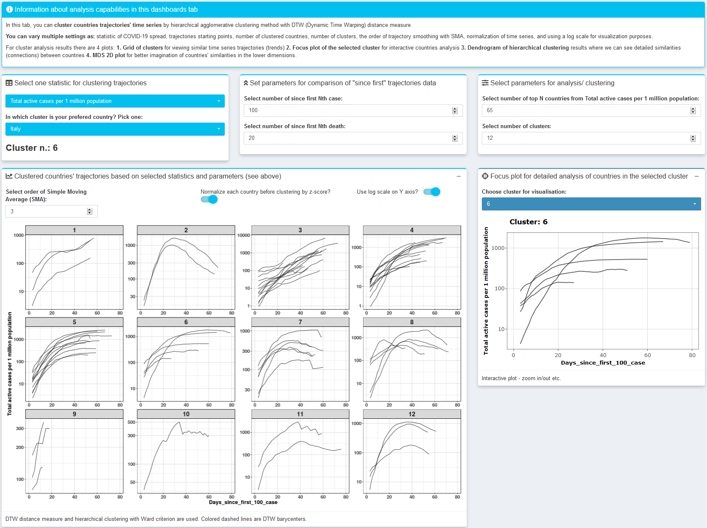

# CoronaDash

#### [**Shinydashboard online application is available on this link**](https://petolau.shinyapps.io/coronadash/)

  
   
  
  

This `shiny`/`shinydashboard` application is for informative purposes, how the **COVID-19** virus can spread over time for a defined country (or whole world) and period of days (cases and deaths).
There isn't motivation to replace more sophisticated epidemiology models like SIR.

Application provides also various **data mining/ visualization techniques** for comparing countries' COVID-19 data statistics as:

 * **trajectories** of cases/ deaths spread,
 * 2D/ **multidimensional clustering** of countries' data/ statistics - with dendogram and table of clusters averages,
 * **hierarchical clustering of countries' trajectories** based on DTW distance and preprocessing by SMA (+ normalization), for fast comparison of large number of countries' COVID-19 magnitudes and trends,
 * **aggregated views** for the whole World,
 * every statistic is also computed per 1 million population for more **interpretable and comparable analysis**.

Data are coming from [Johns Hopkins CSSE GitHub repository](https://github.com/CSSEGISandData/COVID-19/tree/master/csse_covid_19_data/csse_covid_19_time_series). Tests data are coming from [COVID19 Data Hub](https://covid19datahub.io/index.html).

The forecasting model is the ETS (**Exponential smoothing**) implemented in a [`smooth` R package](https://cran.r-project.org/package=smooth), so only historical data of target time series are used.
For total cumulative confirmed cases, the multiplicative model is used.
For total cumulative death cases of the World, the fully multiplicative model is used
(it is the possibility of using a damped trend in both situations).

The forecasting model applied on the Covid-19 use case was inspired by [Fotios Petropoulos tweets](https://twitter.com/fotpetr).

You can read more about my work on my blog: [**petolau.github.io**](https://petolau.github.io).

**Take care of yourself!**
